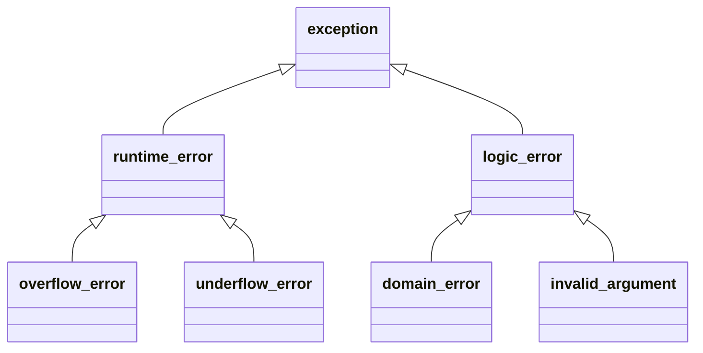

# 第5章 语句 - 总结笔记

---

## **1. 简单语句（Simple Statements）**

- **空语句（Null Statement）：** 仅包含一个分号 `;`，表示语法上需要一条语句，但逻辑上不需要。
  ```c++
  while (cin >> s && s != sought)
      ;   // 空语句，常配合注释解释用途
  ```

- **复合语句（Compound Statement）：** 用花括号 `{}` 包裹的语句块，可包含声明和其他语句。也称为**块（block）**。
  - **作用域：** 块内定义的变量只能在块内或嵌套块中使用。
  - **空块：** 等价于空语句。

---

## **2. 语句作用域（Statement Scope）**

- **语句内部变量：**
  - 可以在 `if`、`switch`、`while` 和 `for` 的控制结构中定义变量。
  - 这些变量仅在相应语句内部可见，超出语句作用范围后即销毁。
  ```c++
  while (int i = get_num())  // i 在 while 内部作用域
      cout << i << endl;
  // i = 0;  // 错误：i 已超出作用域
  ```

---

## **3. 条件语句（Conditional Statements）**

### **3.1 `if` 语句**
- 基本形式：
  ```c++
  if (condition) {
      statement;
  } else {
      statement;
  }
  ```
- **逻辑：**
  - 条件 `condition` 为真时执行 `if` 块；否则执行 `else` 块。
  - `condition` 可以是布尔表达式，也可以是初始化变量的声明。

- **嵌套规则：** `else` 总是匹配最近的未匹配 `if`。

---

### **3.2 `switch` 语句**
- 基本形式：
  ```c++
  switch (expression) {
      case value1:
          statement1;
          break;
      case value2:
          statement2;
          break;
      default:
          statement3;
          break;
  }
  ```
- **特性：**
  - `switch` 会根据 `expression` 的值跳转到匹配的 `case` 标签。
  - 每个 `case` 标签的值必须是**整型常量表达式**。
  - **`break`：** 终止当前 `case` 的执行，防止继续向下执行其他 `case` 分支。
  - **`default`：** 用于处理所有未匹配的情况。

- **注意事项：**
  - 如果 `case` 标签后没有 `break`，需用注释解释。
  - 不允许跳过变量的初始化语句直接跳到其作用域内。

---

## **4. 迭代语句（Iterative Statements）**

### **4.1 `while` 语句**
- 基本形式：
  ```c++
  while (condition) {
      statement;
  }
  ```
- **特性：**
  - 每次循环先检查 `condition`，为真则执行 `statement`。
  - 如果 `condition` 初次即为假，则循环体一次也不会执行。

- **适用场景：**
  - 适合**不确定迭代次数**，或需要在循环外使用控制变量的情况。

---

### **4.2 传统的 `for` 语句**
- 基本形式：
  ```c++
  for (initializer; condition; expression) {
      statement;
  }
  ```
- **特性：**
  - `initializer`：初始化循环控制变量。
  - `condition`：控制循环条件。
  - `expression`：更新循环控制变量。
  - 如果 `condition` 初次为假，循环体不会执行。

- **注意：**
  - 可以在 `initializer` 中定义多个变量，但类型必须相同。
  - 定义在 `for` 语句头部的变量作用域仅限于循环体内。

---

### **4.3 范围 `for` 语句（Range `for` Statement）**
- 基本形式：
  ```c++
  for (declaration : expression) {
      statement;
  }
  ```
- **特性：**
  - 用于遍历一个范围（如容器、数组等）。
  - `declaration` 定义循环变量，其类型由 `expression` 中的元素类型推断。
  - 如果需要修改元素值，声明循环变量为引用类型。

---

### **4.4 `do-while` 语句**
- 基本形式：
  ```c++
  do {
      statement;
  } while (condition);
  ```
- **特性：**
  - **先执行一次循环体，再检查条件。**
  - 即使 `condition` 初次为假，循环体也会至少执行一次。

---

## **5. 跳转语句（Jump Statements）**

### **5.1 `break` 语句**
- 终止离其最近的 `while`、`do-while`、`for` 或 `switch` 语句，并跳出循环或语句块。
  ```c++
  while (true) {
      if (condition)
          break;  // 跳出循环
  }
  ```

---

### **5.2 `continue` 语句**
- 终止本次循环，立即进入下一次迭代。
  ```c++
  for (int i = 0; i < 10; ++i) {
      if (i % 2 == 0)
          continue;  // 跳过偶数
      cout << i << " ";
  }
  ```

---

### **5.3 `goto` 语句**
- 直接跳转到指定的标签（`label`）。
  ```c++
  goto label;
  label:
      statement;
  ```
- **限制：**
  - 不能跨越变量作用域。
  - 不建议使用，因其降低程序可读性和维护性。

---

## **6. 异常处理（Exception Handling）**

### **6.1 `throw` 表达式**
- 用于引发异常，格式为：
  ```c++
  throw expression;
  ```
- `expression` 是抛出的异常对象。

---

### **6.2 `try` 语句块**
- 基本形式：
  ```c++
  try {
      // 正常逻辑
  } catch (exception-declaration) {
      // 异常处理
  } catch (...) {
      // 捕获所有异常
  }
  ```
- **特性：**
  - `try` 块中抛出的异常会匹配对应的 `catch` 子句。
  - 若无匹配的 `catch` 子句，调用 `terminate` 终止程序。

---

### **6.3 标准异常**
- **异常类继承体系：**



- **常见异常类：**

| **异常类型**       | **描述**                  |
|--------------------|---------------------------|
| `exception`        | 所有异常的基类            |
| `runtime_error`    | 运行时错误                |
| `overflow_error`   | 算术上溢                  |
| `underflow_error`  | 算术下溢                  |
| `logic_error`      | 程序逻辑错误              |
| `domain_error`     | 参数值超出定义域          |
| `invalid_argument` | 无效参数                  |
| `out_of_range`     | 超出容器边界              |

---

## **总结**
- 熟练使用条件语句（`if` 和 `switch`）控制程序逻辑。
- 根据需求选择合适的循环语句（`while`、`for`、`do-while` 或范围 `for`）。
- 跳转语句（如 `break` 和 `continue`）用于控制循环流程，但应避免使用 `goto`。
- 利用异常处理机制（`throw` 和 `try-catch`），编写健壮的程序。